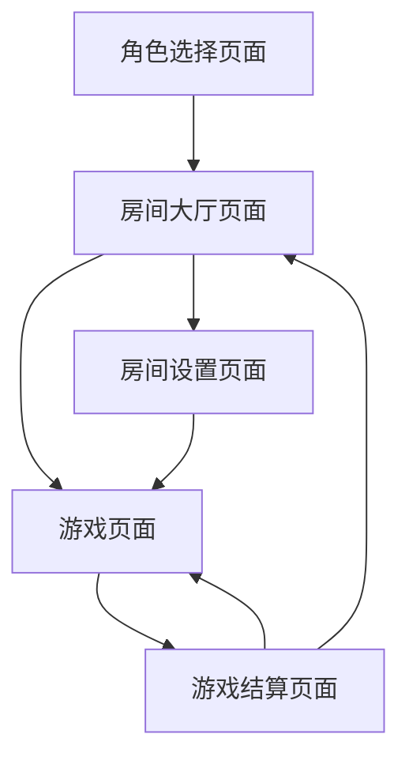

# 德州扑克工具产品需求文档

## 1. Product Overview
德州扑克工具是一个在线多人德州扑克游戏平台，支持房间管理和完整的德州扑克游戏流程。
- 解决线上德州扑克游戏需求，为玩家提供便捷的多人游戏体验，支持自定义房间设置和完整的游戏规则。
- 目标是为德州扑克爱好者提供一个简单易用的在线游戏平台，支持私人房间和朋友间的游戏。

## 2. Core Features

### 2.1 User Roles
| Role | Registration Method | Core Permissions |
|------|---------------------|------------------|
| 房主 | 创建房间时自动获得 | 可设置房间参数、开始游戏、管理玩家 |
| 普通玩家 | 加入房间 | 可参与游戏、进行下注操作 |

### 2.2 Feature Module
我们的德州扑克工具包含以下主要页面：
1. **角色选择页面**：选择mock角色，设置玩家身份参数。
2. **房间大厅页面**：显示房间列表，提供创建房间和加入房间功能。
3. **房间设置页面**：房主设置大小盲、总筹码、房间密码等参数。
4. **游戏页面**：德州扑克游戏主界面，包含牌桌、玩家信息、下注操作等。
5. **游戏结算页面**：显示游戏结果和筹码变化。

### 2.3 Mock角色系统设计

#### 2.3.1 预设角色信息
| 角色名称 | 用户ID | 头像 | 初始筹码 | 角色特点 |
|---------|--------|------|----------|----------|
| Bob | bob | 🧑‍💼 | 1000 | 稳重型玩家，偏保守策略 |
| Alice | alice | 👩‍💻 | 1200 | 激进型玩家，喜欢加注 |
| Charlie | charlie | 👨‍🎨 | 800 | 新手玩家，操作较慢 |
| David | david | 👨‍🔬 | 1500 | 专业玩家，计算精准 |
| Eva | eva | 👩‍🚀 | 1000 | 随机型玩家，难以预测 |
| Frank | frank | 👨‍🍳 | 900 | 谨慎型玩家，很少诈唬 |

#### 2.3.2 URL参数透传机制
- **参数格式**: `?user={角色ID}`，例如 `?user=bob`
- **透传规则**: 所有页面跳转时自动保持user参数
- **参数验证**: 检查user参数是否为有效的预设角色ID
- **默认处理**: 如果URL中没有user参数，自动跳转到角色选择页面
- **状态管理**: 使用React Context全局管理当前用户角色信息

#### 2.3.3 角色状态管理
```typescript
interface MockUser {
  id: string;
  name: string;
  avatar: string;
  initialChips: number;
  personality: string;
  currentChips?: number;
  currentRoom?: string;
}
```

### 2.4 Page Details
| Page Name | Module Name | Feature description |
|-----------|-------------|---------------------|
| 角色选择页面 | 角色选择模块 | 显示6个预设角色卡片，包含头像、姓名、特点描述。点击选择后跳转到大厅页面并在URL添加user参数 |
| 角色选择页面 | 角色验证模块 | 检测URL中的user参数，如果已有有效角色则直接跳转到大厅，无效则重新选择 |
| 房间大厅页面 | 房间列表模块 | 显示当前可用房间列表，包含房间名称、玩家数量、状态信息 |
| 房间大厅页面 | 房间操作模块 | 提供创建新房间和加入现有房间的按钮和表单 |
| 房间设置页面 | 房间配置模块 | 设置大小盲注额、初始筹码数量、房间密码、最大玩家数等参数 |
| 游戏页面 | 牌桌显示模块 | 显示公共牌区域、底池金额、当前下注轮次信息 |
| 游戏页面 | 玩家信息模块 | 显示所有玩家的头像、筹码数量、手牌、当前状态（跟注/弃牌/全押等） |
| 游戏页面 | 游戏操作模块 | 提供完整的德州扑克操作：过牌、跟注、加注、全押、弃牌，根据游戏状态动态显示可用操作 |
| 游戏页面 | 游戏流程控制 | 管理翻牌前、翻牌、转牌、河牌各阶段的自动流转和计时 |
| 游戏页面 | 状态管理模块 | 实时更新游戏状态、底池计算、筹码分配、轮次切换等核心逻辑 |
| 游戏结算页面 | 结果显示模块 | 显示获胜玩家、牌型比较、筹码分配结果 |

### 2.5 游戏操作系统详细设计

#### 2.5.1 游戏操作类型
| 操作名称 | 英文名称 | 操作条件 | 操作效果 | UI显示逻辑 |
|---------|----------|----------|----------|------------|
| 过牌 | Check | 当前无需跟注（下注额为0） | 不增加筹码，轮到下一玩家 | 当前下注为0时显示 |
| 跟注 | Call | 有其他玩家下注且自己筹码足够 | 跟上当前最高下注额 | 当前下注>0且筹码足够时显示 |
| 加注 | Raise | 有足够筹码进行加注 | 增加下注额，重置下注轮次 | 筹码足够时显示，包含加注滑块 |
| 全押 | All-in | 任何时候都可选择 | 押上所有剩余筹码 | 始终显示，特殊颜色标识 |
| 弃牌 | Fold | 任何时候都可选择 | 退出当前局，不参与后续操作 | 始终显示，灰色按钮 |

#### 2.5.2 操作交互设计

**过牌（Check）操作**
- 触发条件：当前轮次无人下注或下注额为0
- 操作效果：玩家不增加筹码投入，直接轮到下一位玩家
- UI反馈：按钮点击后显示"过牌"标识，玩家头像旁显示Check状态
- 状态变化：游戏状态中记录玩家操作，切换到下一玩家

**跟注（Call）操作**
- 触发条件：当前轮次有其他玩家下注，且自己筹码足够跟注
- 操作效果：投入筹码至与当前最高下注额相等
- UI反馈：显示跟注金额，筹码动画从玩家区域移动到底池
- 状态变化：更新玩家筹码、底池金额、玩家下注状态

**加注（Raise）操作**
- 触发条件：玩家有足够筹码进行加注（至少是当前下注的2倍）
- 操作界面：滑块选择加注金额，显示最小/最大加注额
- 操作效果：设置新的下注标准，重置其他玩家的操作状态
- UI反馈：加注金额高亮显示，重新开始下注轮次指示器
- 状态变化：更新当前下注额、重置玩家操作状态、切换下注轮次

**全押（All-in）操作**
- 触发条件：任何时候都可选择，将所有剩余筹码投入
- 操作效果：玩家投入所有筹码，后续轮次自动跟注
- UI反馈：特殊动画效果，玩家状态显示"All-in"，筹码清零
- 状态变化：玩家标记为全押状态，后续自动参与但不再操作

**弃牌（Fold）操作**
- 触发条件：任何时候都可选择
- 操作效果：玩家退出当前局，手牌面朝下，不参与后续操作
- UI反馈：手牌变灰，玩家头像半透明，显示"已弃牌"状态
- 状态变化：玩家标记为弃牌状态，从当前局中移除

#### 2.5.3 游戏状态管理

**状态数据结构**
```typescript
interface GameState {
  phase: 'preflop' | 'flop' | 'turn' | 'river' | 'showdown';
  currentPlayer: string;
  pot: number;
  currentBet: number;
  minRaise: number;
  players: PlayerState[];
  communityCards: Card[];
  bettingRound: number;
  isRoundComplete: boolean;
}

interface PlayerState {
  id: string;
  chips: number;
  currentBet: number;
  status: 'active' | 'folded' | 'allin' | 'disconnected';
  hasActed: boolean;
  lastAction: 'check' | 'call' | 'raise' | 'fold' | 'allin' | null;
}
```

**状态转换逻辑**
1. **操作验证**：检查操作是否合法（筹码是否足够、是否轮到该玩家等）
2. **状态更新**：更新玩家状态、筹码、底池等数据
3. **轮次判断**：检查是否所有玩家都已操作，决定是否进入下一阶段
4. **阶段切换**：从翻牌前→翻牌→转牌→河牌→摊牌的自动流转
5. **结算触发**：当只剩一个玩家或到达摊牌阶段时触发结算

#### 2.5.4 底池和筹码计算

**底池计算规则**
- 主底池：所有玩家都能争夺的筹码
- 边底池：当有玩家全押时，超出部分形成边底池
- 计算公式：底池 = 所有玩家当前轮次投入筹码之和

**筹码分配逻辑**
- 单一获胜者：获得全部底池
- 多个获胜者：按牌力大小分配，相同牌力平分
- 边底池处理：按参与玩家的牌力分别计算

**操作限制规则**
- 最小加注：当前下注额的2倍或上一次加注额
- 最大加注：玩家剩余筹码数量
- 全押保护：全押玩家自动跟注后续下注
- 弃牌保护：弃牌玩家不参与任何后续操作

## 3. Core Process

**玩家游戏流程：**
1. 用户访问根路径，系统检测URL中是否有user参数
   - 如果有有效的user参数，直接跳转到房间大厅
   - 如果没有或参数无效，显示角色选择页面
2. 在角色选择页面，用户从6个预设角色中选择一个（Bob、Alice、Charlie、David、Eva、Frank）
3. 选择角色后，系统更新URL为 `/lobby?user={角色ID}`，跳转到房间大厅
4. 在房间大厅及后续所有页面，URL始终保持user参数，确保角色身份持续有效
5. 在房间大厅可以选择创建新房间或加入现有房间，所有操作都会携带当前角色信息
4. 创建房间的玩家成为房主，可以设置房间参数（大小盲、筹码、密码等）
5. 其他玩家通过房间列表或房间ID加入房间
6. 房主确认玩家数量后开始游戏
7. 游戏按照德州扑克标准流程进行：发牌→翻牌前下注→翻牌→下注→转牌→下注→河牌→下注→摊牌结算
8. 每轮游戏结束后显示结算结果，可选择继续下一局或退出房间

**房主管理流程：**
1. 房主创建房间后进入房间设置页面
2. 设置游戏参数：大小盲注、初始筹码、房间密码、最大玩家数
3. 等待其他玩家加入房间
4. 确认玩家准备状态后开始游戏
5. 游戏过程中可以管理玩家（踢出、暂停等）



## 4. User Interface Design
### 4.1 Design Style
- 主色调：深绿色（#0F5132）模拟真实赌桌，辅助色为金色（#FFD700）突出重要信息
- 按钮样式：圆角矩形按钮，带有轻微阴影效果，hover时有颜色变化
- 字体：主要使用16px的无衬线字体，重要信息使用18-20px加粗
- 布局风格：卡片式布局，顶部导航栏显示当前用户和筹码信息
- 图标风格：使用扑克牌相关的图标，简洁的线条风格

### 4.2 Page Design Overview
| Page Name | Module Name | UI Elements |
|-----------|-------------|-------------|
| 角色选择页面 | 角色选择模块 | 卡片式角色展示，每个角色包含头像、姓名、简介，点击选择后高亮显示 |
| 房间大厅页面 | 房间列表模块 | 表格形式显示房间信息，包含房间名、玩家数、状态标签，支持筛选和搜索 |
| 房间大厅页面 | 房间操作模块 | 大号的"创建房间"和"加入房间"按钮，使用对比色突出显示 |
| 房间设置页面 | 房间配置模块 | 表单布局，包含数字输入框、下拉选择、密码输入等，实时预览设置效果 |
| 游戏页面 | 牌桌显示模块 | 椭圆形牌桌布局，中央显示公共牌和底池，使用绿色背景模拟真实牌桌 |
| 游戏页面 | 玩家信息模块 | 圆形头像+筹码显示，当前操作玩家高亮边框，手牌区域支持翻牌动画 |
| 游戏页面 | 下注操作模块 | 底部操作栏，包含弃牌、跟注、加注滑块、全押按钮，当前可操作按钮高亮 |
| 游戏结算页面 | 结果显示模块 | 模态框形式，显示获胜玩家动画效果，筹码变化用颜色区分增减 |

### 4.3 Responsiveness
产品采用桌面优先设计，同时适配平板设备。游戏页面针对触屏设备优化了按钮大小和间距，确保移动端也能流畅操作。