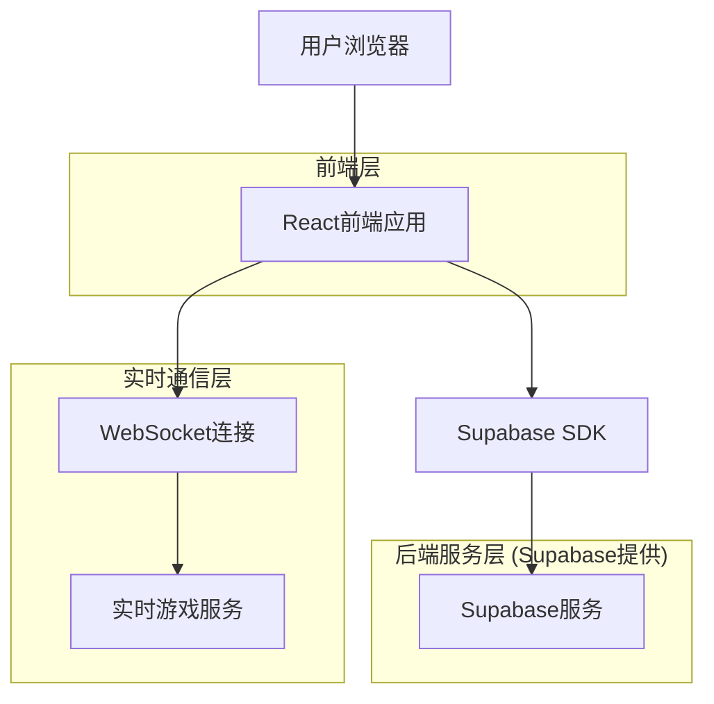
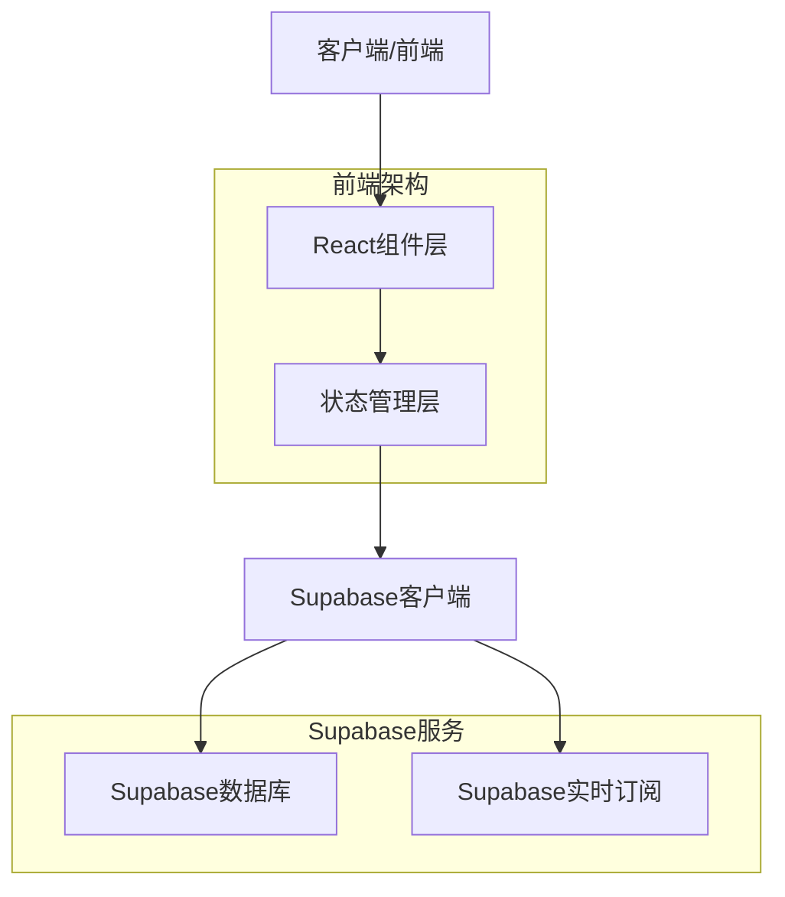
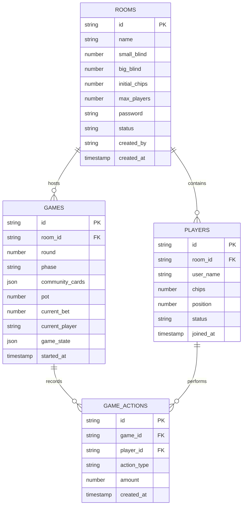

# 德州扑克工具技术架构文档

## 1. Architecture design



## 2. Technology Description

* 前端: React\@18 + TypeScript + Tailwind CSS + Vite

* 后端: Supabase (PostgreSQL + 实时订阅)

* 实时通信: Supabase Realtime (WebSocket)

* 状态管理: React Context + useReducer (用户角色状态管理)

### 2.1 Mock角色系统技术实现

#### 用户Context设计

```typescript
// 用户角色数据类型
interface MockUser {
  id: string;
  name: string;
  avatar: string;
  initialChips: number;
  personality: string;
  currentChips: number;
  currentRoom?: string;
}

// 用户Context
interface UserContextType {
  currentUser: MockUser | null;
  setCurrentUser: (user: MockUser) => void;
  updateUserChips: (chips: number) => void;
  joinRoom: (roomId: string) => void;
  leaveRoom: () => void;
}

// 预设角色数据
const MOCK_USERS: Record<string, MockUser> = {
  bob: { id: 'bob', name: 'Bob', avatar: '🧑‍💼', initialChips: 1000, personality: '稳重型', currentChips: 1000 },
  alice: { id: 'alice', name: 'Alice', avatar: '👩‍💻', initialChips: 1200, personality: '激进型', currentChips: 1200 },
  charlie: { id: 'charlie', name: 'Charlie', avatar: '👨‍🎨', initialChips: 800, personality: '新手型', currentChips: 800 },
  david: { id: 'david', name: 'David', avatar: '👨‍🔬', initialChips: 1500, personality: '专业型', currentChips: 1500 },
  eva: { id: 'eva', name: 'Eva', avatar: '👩‍🚀', initialChips: 1000, personality: '随机型', currentChips: 1000 },
  frank: { id: 'frank', name: 'Frank', avatar: '👨‍🍳', initialChips: 900, personality: '谨慎型', currentChips: 900 }
};
```

#### URL参数同步Hook

```typescript
// 自定义Hook：同步URL参数和用户状态
function useUserFromURL() {
  const [searchParams, setSearchParams] = useSearchParams();
  const { currentUser, setCurrentUser } = useContext(UserContext);
  
  useEffect(() => {
    const userParam = searchParams.get('user');
    if (userParam && MOCK_USERS[userParam] && currentUser?.id !== userParam) {
      setCurrentUser(MOCK_USERS[userParam]);
    }
  }, [searchParams, currentUser, setCurrentUser]);
  
  const updateUserParam = (userId: string) => {
    setSearchParams(prev => {
      prev.set('user', userId);
      return prev;
    });
  };
  
  return { updateUserParam };
}
```

### 2.2 游戏操作系统技术实现

#### 游戏状态管理

```typescript
// 游戏状态数据结构
interface GameState {
  phase: 'preflop' | 'flop' | 'turn' | 'river' | 'showdown';
  currentPlayer: string;
  pot: number;
  currentBet: number;
  minRaise: number;
  players: PlayerState[];
  communityCards: Card[];
  bettingRound: number;
  isRoundComplete: boolean;
}

interface PlayerState {
  id: string;
  chips: number;
  currentBet: number;
  status: 'active' | 'folded' | 'allin' | 'disconnected';
  hasActed: boolean;
  lastAction: 'check' | 'call' | 'raise' | 'fold' | 'allin' | null;
}

// 游戏操作类型
type GameAction = {
  type: 'PLAYER_ACTION';
  payload: {
    playerId: string;
    action: 'check' | 'call' | 'raise' | 'fold' | 'allin';
    amount?: number;
  };
} | {
  type: 'NEXT_PHASE';
} | {
  type: 'RESET_ROUND';
};

// 游戏状态Reducer
function gameReducer(state: GameState, action: GameAction): GameState {
  switch (action.type) {
    case 'PLAYER_ACTION':
      return handlePlayerAction(state, action.payload);
    case 'NEXT_PHASE':
      return advanceGamePhase(state);
    case 'RESET_ROUND':
      return resetBettingRound(state);
    default:
      return state;
  }
}
```

#### 操作验证逻辑

```typescript
// 操作验证函数
function validatePlayerAction(
  gameState: GameState,
  playerId: string,
  action: string,
  amount?: number
): { valid: boolean; error?: string } {
  const player = gameState.players.find(p => p.id === playerId);
  
  if (!player) {
    return { valid: false, error: '玩家不存在' };
  }
  
  if (gameState.currentPlayer !== playerId) {
    return { valid: false, error: '不是该玩家的回合' };
  }
  
  if (player.status !== 'active') {
    return { valid: false, error: '玩家状态不允许操作' };
  }
  
  switch (action) {
    case 'check':
      if (gameState.currentBet > player.currentBet) {
        return { valid: false, error: '有下注时不能过牌' };
      }
      break;
      
    case 'call':
      const callAmount = gameState.currentBet - player.currentBet;
      if (callAmount <= 0) {
        return { valid: false, error: '无需跟注' };
      }
      if (player.chips < callAmount) {
        return { valid: false, error: '筹码不足' };
      }
      break;
      
    case 'raise':
      if (!amount || amount < gameState.minRaise) {
        return { valid: false, error: '加注金额不足' };
      }
      if (player.chips < amount) {
        return { valid: false, error: '筹码不足' };
      }
      break;
      
    case 'allin':
      if (player.chips <= 0) {
        return { valid: false, error: '没有筹码可以全押' };
      }
      break;
      
    case 'fold':
      // 弃牌总是有效的
      break;
      
    default:
      return { valid: false, error: '无效操作' };
  }
  
  return { valid: true };
}
```

#### 实时同步机制

```typescript
// 游戏状态同步Hook
function useGameSync(roomId: string) {
  const [gameState, dispatch] = useReducer(gameReducer, initialGameState);
  const supabase = useSupabaseClient();
  
  useEffect(() => {
    // 订阅游戏状态变化
    const subscription = supabase
      .channel(`game:${roomId}`)
      .on('postgres_changes', {
        event: '*',
        schema: 'public',
        table: 'games',
        filter: `room_id=eq.${roomId}`
      }, (payload) => {
        // 更新本地游戏状态
        updateLocalGameState(payload.new);
      })
      .on('broadcast', { event: 'player_action' }, (payload) => {
        // 处理玩家操作广播
        dispatch({
          type: 'PLAYER_ACTION',
          payload: payload.payload
        });
      })
      .subscribe();
      
    return () => {
      subscription.unsubscribe();
    };
  }, [roomId, supabase]);
  
  // 发送玩家操作
  const sendPlayerAction = async (action: string, amount?: number) => {
    const validation = validatePlayerAction(gameState, currentUser.id, action, amount);
    
    if (!validation.valid) {
      throw new Error(validation.error);
    }
    
    // 广播操作到其他玩家
    await supabase.channel(`game:${roomId}`).send({
      type: 'broadcast',
      event: 'player_action',
      payload: {
        playerId: currentUser.id,
        action,
        amount
      }
    });
    
    // 更新数据库
    await supabase.from('game_actions').insert({
      game_id: gameState.id,
      player_id: currentUser.id,
      action_type: action,
      amount: amount || 0
    });
  };
  
  return { gameState, sendPlayerAction };
}
```

* 路由: React Router\@6

## 3. Route definitions

| Route         | Purpose                 | URL参数要求                        |
| ------------- | ----------------------- | ------------------------------ |
| /             | 角色选择页面，用户选择mock角色身份     | 无user参数时显示，有效user参数时重定向到/lobby |
| /lobby        | 房间大厅页面，显示房间列表和创建/加入房间功能 | 必须包含有效的?user={角色ID}参数          |
| /room/create  | 房间设置页面，房主配置房间参数         | 必须包含有效的?user={角色ID}参数          |
| /room/:roomId | 游戏页面，德州扑克游戏主界面          | 必须包含有效的?user={角色ID}参数          |
| /game/result  | 游戏结算页面，显示单局游戏结果         | 必须包含有效的?user={角色ID}参数          |

### 3.1 路由守卫机制

```typescript
// 路由守卫：检查user参数有效性
const VALID_USERS = ['bob', 'alice', 'charlie', 'david', 'eva', 'frank'];

function ProtectedRoute({ children }: { children: React.ReactNode }) {
  const [searchParams] = useSearchParams();
  const user = searchParams.get('user');
  
  if (!user || !VALID_USERS.includes(user)) {
    return <Navigate to="/" replace />;
  }
  
  return <>{children}</>;
}
```

## 4. API definitions

### 4.1 Core API

房间管理相关

```
POST /api/rooms
```

Request:

| Param Name   | Param Type | isRequired | Description |
| ------------ | ---------- | ---------- | ----------- |
| name         | string     | true       | 房间名称        |
| smallBlind   | number     | true       | 小盲注额        |
| bigBlind     | number     | true       | 大盲注额        |
| initialChips | number     | true       | 初始筹码数量      |
| maxPlayers   | number     | true       | 最大玩家数       |
| password     | string     | false      | 房间密码        |
| createdBy    | string     | true       | 创建者用户ID     |

Response:

| Param Name | Param Type | Description |
| ---------- | ---------- | ----------- |
| id         | string     | 房间唯一标识      |
| status     | string     | 房间状态        |
| players    | array      | 当前玩家列表      |

Example:

```json
{
  "name": "Bob的房间",
  "smallBlind": 10,
  "bigBlind": 20,
  "initialChips": 1000,
  "maxPlayers": 6,
  "password": "123456",
  "createdBy": "bob"
}
```

游戏操作相关

```
POST /api/game/action
```

Request:

| Param Name | Param Type | isRequired | Description                  |
| ---------- | ---------- | ---------- | ---------------------------- |
| roomId     | string     | true       | 房间ID                         |
| playerId   | string     | true       | 玩家ID                         |
| action     | string     | true       | 操作类型 (fold/call/raise/allin) |
| amount     | number     | false      | 下注金额 (加注时必需)                 |

Response:

| Param Name | Param Type | Description |
| ---------- | ---------- | ----------- |
| success    | boolean    | 操作是否成功      |
| gameState  | object     | 更新后的游戏状态    |

## 5. Server architecture diagram



## 6. Data model

### 6.1 Data model definition



### 6.2 Data Definition Language

房间表 (rooms)

```sql
-- 创建房间表
CREATE TABLE rooms (
    id UUID PRIMARY KEY DEFAULT gen_random_uuid(),
    name VARCHAR(100) NOT NULL,
    small_blind INTEGER NOT NULL,
    big_blind INTEGER NOT NULL,
    initial_chips INTEGER NOT NULL,
    max_players INTEGER NOT NULL CHECK (max_players >= 2 AND max_players <= 10),
    password VARCHAR(50),
    status VARCHAR(20) DEFAULT 'waiting' CHECK (status IN ('waiting', 'playing', 'finished')),
    created_by VARCHAR(50) NOT NULL,
    created_at TIMESTAMP WITH TIME ZONE DEFAULT NOW(),
    updated_at TIMESTAMP WITH TIME ZONE DEFAULT NOW()
);

-- 创建索引
CREATE INDEX idx_rooms_status ON rooms(status);
CREATE INDEX idx_rooms_created_by ON rooms(created_by);

-- 权限设置
GRANT SELECT ON rooms TO anon;
GRANT ALL PRIVILEGES ON rooms TO authenticated;
```

玩家表 (players)

```sql
-- 创建玩家表
CREATE TABLE players (
    id UUID PRIMARY KEY DEFAULT gen_random_uuid(),
    room_id UUID REFERENCES rooms(id) ON DELETE CASCADE,
    user_name VARCHAR(50) NOT NULL,
    chips INTEGER NOT NULL,
    position INTEGER NOT NULL,
    status VARCHAR(20) DEFAULT 'active' CHECK (status IN ('active', 'folded', 'allin', 'disconnected')),
    joined_at TIMESTAMP WITH TIME ZONE DEFAULT NOW()
);

-- 创建索引
CREATE INDEX idx_players_room_id ON players(room_id);
CREATE INDEX idx_players_position ON players(room_id, position);

-- 权限设置
GRANT SELECT ON players TO anon;
GRANT ALL PRIVILEGES ON players TO authenticated;
```

游戏表 (games)

```sql
-- 创建游戏表
CREATE TABLE games (
    id UUID PRIMARY KEY DEFAULT gen_random_uuid(),
    room_id UUID REFERENCES rooms(id) ON DELETE CASCADE,
    round INTEGER NOT NULL DEFAULT 1,
    phase VARCHAR(20) DEFAULT 'preflop' CHECK (phase IN ('preflop', 'flop', 'turn', 'river', 'showdown')),
    community_cards JSONB DEFAULT '[]',
    pot INTEGER DEFAULT 0,
    current_bet INTEGER DEFAULT 0,
    current_player UUID REFERENCES players(id),
    game_state JSONB DEFAULT '{}',
    started_at TIMESTAMP WITH TIME ZONE DEFAULT NOW(),
    updated_at TIMESTAMP WITH TIME ZONE DEFAULT NOW()
);

-- 创建索引
CREATE INDEX idx_games_room_id ON games(room_id);
CREATE INDEX idx_games_phase ON games(phase);

-- 权限设置
GRANT SELECT ON games TO anon;
GRANT ALL PRIVILEGES ON games TO authenticated;
```

游戏操作表 (game\_actions)

```sql
-- 创建游戏操作表
CREATE TABLE game_actions (
    id UUID PRIMARY KEY DEFAULT gen_random_uuid(),
    game_id UUID REFERENCES games(id) ON DELETE CASCADE,
    player_id UUID REFERENCES players(id) ON DELETE CASCADE,
    action_type VARCHAR(20) NOT NULL CHECK (action_type IN ('fold', 'call', 'raise', 'check', 'allin')),
    amount INTEGER DEFAULT 0,
    created_at TIMESTAMP WITH TIME ZONE DEFAULT NOW()
);

-- 创建索引
CREATE INDEX idx_game_actions_game_id ON game_actions(game_id);
CREATE INDEX idx_game_actions_player_id ON game_actions(player_id);
CREATE INDEX idx_game_actions_created_at ON game_actions(created_at DESC);

-- 权限设置
GRANT SELECT ON game_actions TO anon;
GRANT ALL PRIVILEGES ON game_actions TO authenticated;
```

初始化数据

```sql
-- 插入mock角色数据 (通过应用程序逻辑处理，不存储在数据库中)
-- Mock角色: Bob, Alice, Charlie, David, Eva, Frank

-- 示例房间数据
INSERT INTO rooms (name, small_blind, big_blind, initial_chips, max_players, created_by)
VALUES 
('新手房间', 5, 10, 1000, 6, 'bob'),
('高级房间', 25, 50, 5000, 8, 'alice');
```

